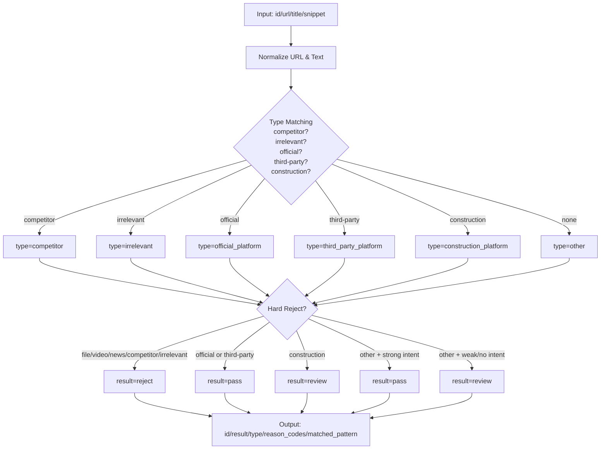

# Step3 判定逻辑优化方案（基于问题反馈）

## 一、现状问题与根因

### 1) 明确无关站点被判为 pass
- 现象：`youtube.com` 结果被判 pass。
- 根因：当前逻辑先按 `type` 早返回；当站点没有命中 `IRRELEVANT_PATTERNS` 时，会走 `high_intent_domain` 分支，标题若含 `procurement/bids` 就会 pass。
- 风险：视频、社媒、资讯聚合页会被“关键词误触发”。

### 2) 类型归类错误（official / third_party / construction）
- 现象：
  - `https://lacovss.lacounty.gov/` 被归为 third_party。
  - `https://www.capitalprograms.ucla.edu/Contracts/Bidding` 被归为 construction_platform。
- 根因：
  - 当前 `_resolve_type` 仅用固定 pattern 列表匹配，缺少“域名后缀语义 + 机构特征词 + 白名单优先级”规则。
  - `.gov/.edu` 等官方域名没有强制优先；且 `construction` 规则在未知机构页面上可能过宽。

### 3) 判断+类型双错（白名单未生效 / 竞品漏拦截）
- 现象：
  - `vendors.planetbids.com/...` 应该 pass/third_party，却被 reject/competitor。
  - `bidbanana.thebidlab.com/...` 在 competitor 清单中，却被 pass/other。
- 根因（高概率）：
  - pattern 配置与运行时文本框内容可能被覆盖（UI 可编辑）；
  - 同一 URL 命中多个分类时缺少“冲突决议矩阵 + 命中证据日志”；
  - 域名标准化不足（子域、端口、重定向 host 差异）导致误判。

### 4) 约 1/3 搜索结果“未处理”
- 现象：人工核对发现并非每条 Google 结果都有 Step3 结论。
- 根因（代码层面）：
  - Step2 会对 URL 去重（`_dedupe_search_results`），同 URL 只保留一条，因此 Step3 处理的是“去重后集合”，不是“原始 Google 全量结果”。
  - 另有少量结果可能因 `link` 为空被 Step2 跳过。

---

## 二、新版判定设计目标

1. **先类型后结果，但类型必须可解释**：输出 `type + result + reasons[] + matched_patterns[]`。
2. **优先级固定化**：`competitor > irrelevant > official > third_party > construction > other`（可配置）。
3. **官方域名兜底**：`.gov/.mil/.edu` 默认官方候选，不允许被 construction 覆盖。
4. **白名单/黑名单冲突可控**：同域冲突时按“精确 host > 父域 > path pattern”+ 优先级决议。
5. **全量可追踪**：Step2 输出 raw_count、dedup_count、dropped_count；Step3 保证对 dedup 集合 100% 有结论。

---

## 三、规则重构方案

## 3.1 规范化层（新增）
- URL 规范化：
  - 小写 host、去端口、去尾部 `/`、保留 path。
  - 解析 `netloc/registrable_domain/subdomain/path`。
- 文本规范化：title/snippet 去噪（多空格、HTML实体）。

## 3.2 类型识别层（替换 `_resolve_type`）
按以下顺序匹配，并记录命中证据：

1. `competitor`：命中 competitor 域名/子域/path。
2. `irrelevant`：命中无关站点域名。
3. `official_platform`：
   - 命中 official pattern；或
   - host 后缀在 `{.gov, .mil}`；或
   - host 后缀 `.edu` 且标题/路径含 `procurement|purchasing|bids|contracts|solicitations|vendor`。
4. `third_party_platform`：命中第三方平台清单（如 `planetbids.com`）。
5. `construction_platform`：仅当命中 construction 清单且**未命中 official/third_party**。
6. 否则 `other`。

## 3.3 结果判定层（pass/review/reject）

### 硬拒绝（最高优先）
- 文件直链（pdf/doc/xls/zip）
- URL/标题命中强无关词（video/social/news-only 等）；`login/register/supplier portal` 不做一刀切 reject，改走按类型分流
- `competitor`、`irrelevant` 类型

### 硬通过
- `official_platform`、`third_party_platform`：默认 pass
- `construction_platform`：默认 review（由原 pass 下调，降低误伤）

### 语义判定（仅 `other`）
- title/snippet 同时命中采购意图词 -> pass
- 仅弱词（list/bid/contract）-> review
- 其他 -> review

---

## 四、针对你给的案例的预期修正

- `youtube.com/watch...` -> `reject / irrelevant`（域名硬拦截）
- `lacovss.lacounty.gov` -> `pass / official_platform`（`.gov` 官方兜底）
- `capitalprograms.ucla.edu/.../Bidding` -> `pass / official_platform`（`.edu`+采购词）
- `vendors.planetbids.com/...` -> `pass / third_party_platform`（third_party 精确匹配 + 白名单优先）
- `bidbanana.thebidlab.com/...` -> `reject / competitor`（竞品硬拦截）

---

## 五、可观测性与质检补强

1. Step3 输出新增字段：
   - `reason_codes`: 例如 `MATCH_COMPETITOR_DOMAIN`, `GOV_SUFFIX_OFFICIAL`, `HARD_REJECT_VIDEO`
   - `matched_pattern`: 命中的具体 pattern
2. 统计报表：
   - `step2_raw_count / step2_dedup_count / step2_dropped_no_link`
   - `step3_count`（必须等于 dedup_count）
3. 回归样本集：
   - 固定 100~200 条人工标注 URL，按每次规则改动自动回归
4. 冲突告警：
   - 同一 URL 若同时命中 competitor 与 whitelist，打 `conflict` 标记并人工复核

---

## 六、流程图（新版 Step3）

---

## 七、落地实施顺序（不改代码版）

1. 先冻结一版 pattern 配置（白名单/黑名单统一来源）。
2. 增加“规则解释输出”与统计字段，先解决“为什么判成这样”。
3. 再替换类型判定优先级与 `.gov/.edu` 兜底。
4. 最后调整 construction 默认策略为 review 并回归测试。

---

## 八、红蓝对抗评审（两轮）

### Round 1

**红方质疑 R1-1：`.gov/.edu` 兜底会引入误报**
- 风险：大量 `.edu` 页面是资讯、实验室、课程页，不是采购入口；`pass` 可能抬高噪声。

**蓝方回应 B1-1：收紧兜底条件 + 分级放行**
- `.gov/.mil`：保持 `official_platform`，但不是无条件 pass，先过硬拒绝（news/blog/login-only）。
- `.edu`：仅在标题或路径命中采购意图词时标记 `official_platform`，否则降为 `other/review`。
- 新增 `OFFICIAL_GUARD_TERMS`（`procurement|purchasing|bids|contracts|solicitations|vendor|sourcing`）。

**红方质疑 R1-2：`construction_platform` 默认 review 可能漏掉高价值线索**
- 风险：部分建设平台实际就是公开招标主入口，全部降 review 会增加人工负担。

**蓝方回应 B1-2：引入“双阈值放行”**
- `construction_platform` 若同时满足：
  1) 非竞品/非无关；
  2) title+snippet 命中>=2个高意图词；
  3) URL/path 命中 `bid|rfp|opportunity|solicitation`；
  则升级为 `pass`，否则 `review`。
- 这样保留精准流量，降低纯资讯页穿透。

### Round 2

**红方质疑 R2-1：白名单与竞品冲突如何“可复现”处理？**
- 风险：如果 `planetbids.com` 子域配置错误，可能再次被 competitor 覆盖；同域不同 path 的意图差异也会导致争议。

**蓝方回应 B2-1：冲突矩阵 + 证据链落库**
- 冲突决议顺序（固定并可配置）：
  1) exact host match
  2) subdomain suffix match
  3) registrable domain match
  4) path pattern match
- 当冲突发生时输出：`conflict=true`、`conflict_candidates[]`、`winner_rule_id`。
- 评审时可直接复现“为什么 `vendors.planetbids.com` 判 third_party 而不是 competitor”。

**红方质疑 R2-2：1/3 未处理可能不止 dedupe，还可能是抓取源质量问题**
- 风险：如果搜索 API 有空 link、异常编码、重定向污染，单靠 dedupe 指标不足以定位。

**蓝方回应 B2-2：补齐链路级观测指标**
- Step2 增加：
  - `raw_rows`（API 返回总条数）
  - `dropped_no_link`
  - `dropped_invalid_url`
  - `dedup_removed`
  - `final_step2_rows`
- Step3 增加：
  - `input_rows`、`output_rows`、`unclassified_rows`（应恒为0）
- 若 `raw_rows - final_step2_rows` 超阈值（如 >25%），触发告警并导出样本。

### 红蓝评审后新增落地项

1. 在规则层新增“兜底守门词”和 `construction` 双阈值升级策略。
2. 在冲突处理层新增 `conflict` 证据结构，支持复现与审计。
3. 在 Step2/Step3 统计中加入链路损耗指标，避免把“未处理”全部归因为去重。
4. 回归集增加 4 类专门样本：
   - `.edu` 非采购页
   - construction 资讯页 vs 招标页
   - whitelist/competitor 冲突子域
   - 空 link / 非法 URL / 重定向异常样本

---

## 九、补充修订（基于评审意见）

### 9.1 `login/register/supplier portal` 规则修订

> 评审意见：`login/register/supplier portal` 对采购平台未必是 reject。像 VSS、Supplier Portal、Public Bid Site 可能是入口页。

将“登录类词”从硬拒绝中拆出，改为**按类型分流**：

1. 若 `type in {competitor, irrelevant}`：`reject`
2. 若 `type in {official_platform, third_party_platform}`：`review`（可配置升级 `pass`）
3. 若 `type == construction_platform`：`review`
4. 若 `type == other`：`reject`

补充说明：
- `supplier portal`, `vendor self service`, `public bid site`, `vss` 命中时，优先判为“入口候选”，至少 `review`，不直接硬拒绝。
- 仅在明确无关语义（如视频/社媒/泛新闻）或命中 competitor/irrelevant 时执行硬拒绝。

### 9.2 Step3 `type` 语义边界澄清

Step3 的 `type` 只用于回答：**该 Google 结果对应域名属于哪一类站点**（官方 / 第三方 / 竞品 / 无关 / 施工平台 / 其他）。

- 它**不等同于**“最终可抓取数据一定在这个域名上”。
- 它的作用是：
  1) 做来源可信度与处理优先级分层；
  2) 决定该结果在 Step3 是 `pass/review/reject`；
  3) 为后续 Step4/人工复核提供上下文。

因此，`official_platform` 或 `third_party_platform` 仅表示“域名身份正确”，并不承诺该 URL 已经是最终列表页。
